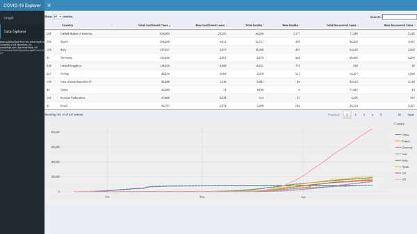

# COVID19Explorer
The Covid-19 Explorer is an R Shiny dashboard that tracks global Coronavirus cases over time, ranging from January 22, 2020 to present.

Link: https://covid19explorer.shinyapps.io/covid19explorer/

UPDATE: Due to R Shiny memory limitations, this data is no longer being updated daily.

