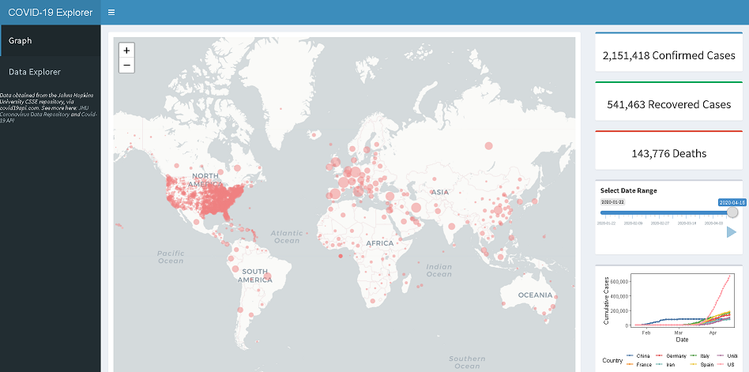
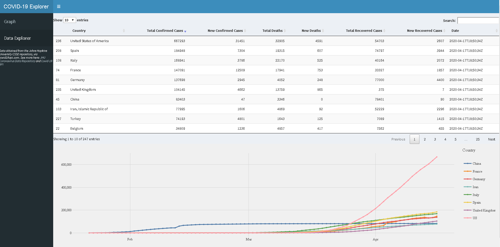

# COVID19Explorer
The Covid-19 Explorer is an R Shiny dashboard that tracks global Coronavirus cases over time, ranging from January 22, 2020 to present.

Link: https://covid19explorer.shinyapps.io/covid19explorer/?_ga=2.103662729.828904711.1591204892-1106858885.1584741817

UPDATE: Due to R Shiny memory limitations, this data can no longer be updated daily.

